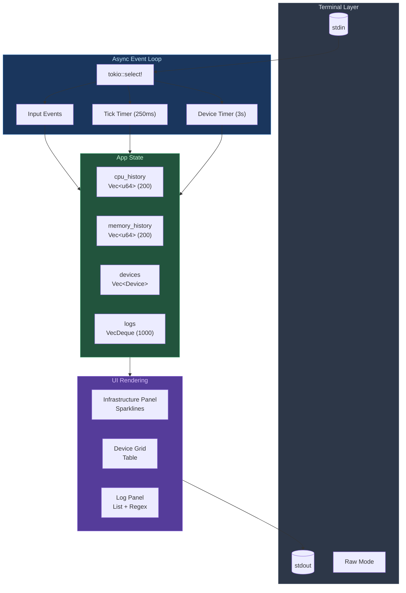
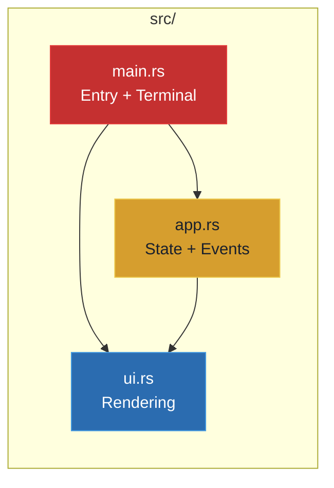

[README.md](https://github.com/user-attachments/files/27305055/README.md)
# FactoryOps Console

[](https://www.rust-lang.org/)
[](LICENSE)

A high-performance, asynchronous Terminal User Interface (TUI) for monitoring manufacturing infrastructure in headless, bandwidth-constrained environments.

## 🏭 Overview

Zero-dependency static binary (~3MB) that deploys via `scp` and runs directly in SSH sessions. Built with Rust and Tokio for real-time infrastructure diagnostics.

## 📸 Screenshots

### Main Dashboard

Real-time infrastructure monitoring with CPU/Memory sparklines, factory floor device grid, and system logs.


### Device Detail View

Per-device diagnostics showing network I/O, latency percentiles, packet loss, and thermal data.


## 🚀 Quick Start

```bash
# Run in simulation mode
cargo run

# Build release binary (~3MB)
cargo build --release

# Deploy to production
scp target/release/factoryops-console user@factory-server:/usr/local/bin/
```

## ⌨️ Controls

| Key | Function |
|-----|----------|
| `q` / `Esc` | Quit |
| `↑` / `↓` | Scroll logs |
| `a` | Toggle auto-scroll |
| `r` | Force device refresh |

## 🏗️ Architecture



## 📦 Module Structure



## 🔩 Device Monitoring

Pre-configured manufacturing equipment:

| Device | IP | Protocol |
|--------|-----|----------|
| Line-1-Printer | 192.168.10.15 | TCP 9100 |
| Pack-Station-A | 192.168.10.22 | TCP |
| STAC6-Drive-01 | 192.168.10.30 | Modbus |
| Line-2-Printer | 192.168.10.16 | TCP 9100 |
| Quality-Scanner | 192.168.10.45 | TCP |

## 🛠️ Tech Stack

- **Rust** 2021 Edition
- **ratatui** – Terminal UI
- **crossterm** – Cross-platform terminal control
- **tokio** – Async runtime

## 📚 Documentation

See [docs/documentation.md](docs/documentation.md) for full technical details.

## 📜 License

MIT – Open source for manufacturing engineering community

---

**Author**: Angel Pinzon | [apinzon.dev](https://apinzon.dev)
