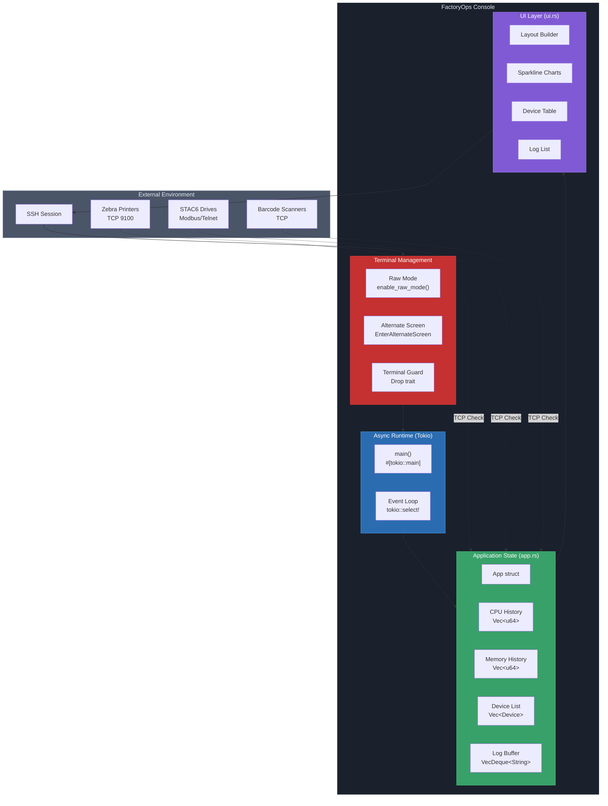
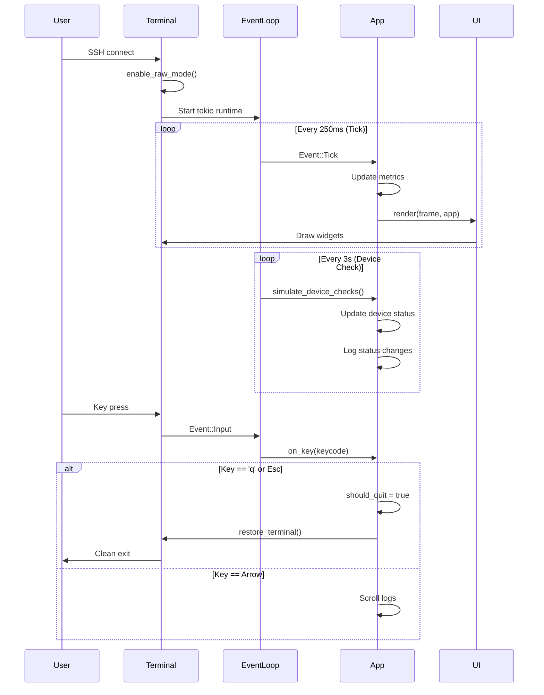
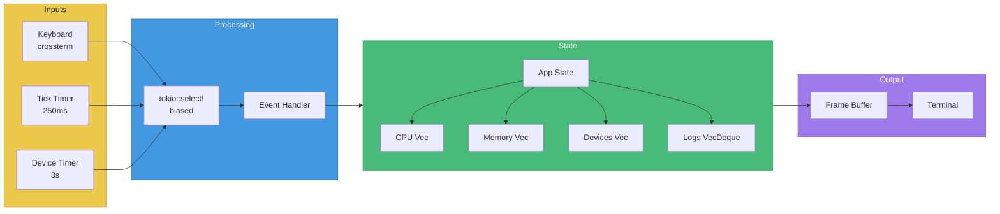
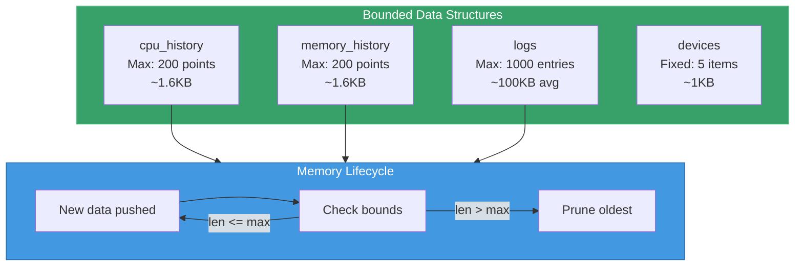
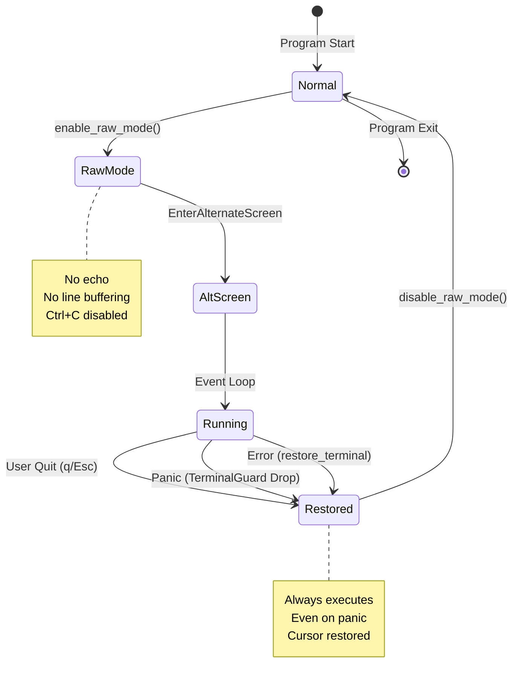
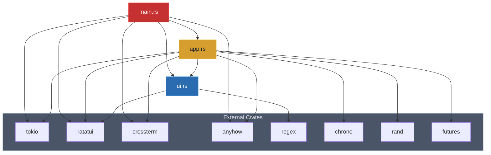
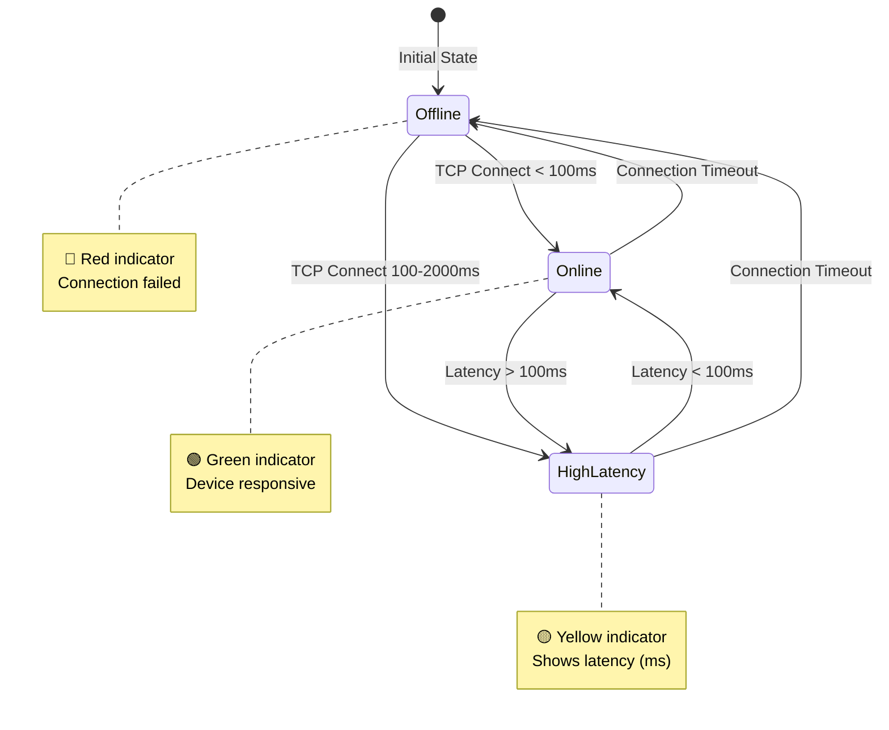

# FactoryOps Console Architecture

## System Overview

## Event Flow (MVI Pattern)

## Data Flow

## Memory Management

## Terminal State Safety

## Module Dependency Graph

## Device Status State Machine

